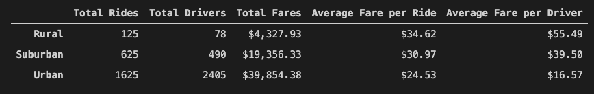
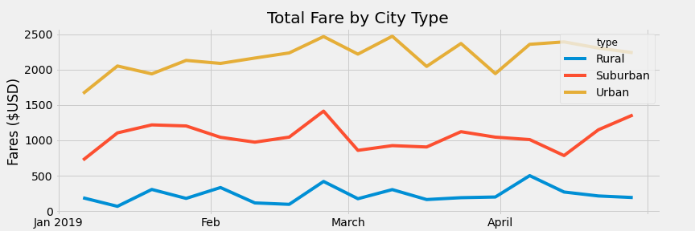

# PyBer_Analysis

## Overview

In this analysis, we will be looking at the city and ride data from PyBer. This analysis will look to identify trends and address any disparities that may be found between city types. More specifically, we will be analyzing a ride-sharing summary DataFrame and a chart of the total fares for each city type.

## Resources

- Data Source: Resources/city_data.csv, Resources/ride_data.csv
- Software: Python 3.7.6, Visual Studio Code 1.56.0

## Results

### Pyber Data Summary

Shown below is a chart displaying data for the following, sorted by city type: Total Rides, Total Drivers, Total Fares, Average Fare per Ride and Average Fare per Drive.

Calculating the totals from the above gives us:
| | Total Rides | Total Drivers | Total Fares | Average Fare per Ride | Average Fare per Driver |
| --- | --- | --- | --- | --- | --- | 
| All City Types | 2375 | 2973 | $63,538.64 | $26.75 | $21.37 |

** Note: Average Fare per Ride for all cities was calculated using Total Fares for all cities divided by Total Rides.
Average Fare per Driver for all cities was calculated using Total Fares for all cities divided by Total Driver. 

* Total Rides\
The rural type provides 5.3% of the total rides for all types.\
The suburban type provides 26.3% of the total rides for all types.\
The urban provides 68.4% of the total rides for all types.

* Total Drivers\
The rural type provides 2.6% of the total drivers for all types.\
The suburban type provides 16.4% of the total drivers for all types.\
The urban type provides 80.9% of the total drivers for all types.

* Total Fares\
The rural type provides 6.8% of the total fares for all types.\
The suburban type provides 30.5% of the total fares for all types.\
The urban type provides 62.7% of the total fares for all types.

* Average Fare per Ride\
The average type fare per ride for all city types was $26.75\
The rural type was 29% above average.\
The suburban type was 16% above average.\
The urban type was 8% below average.

* Average Fare per Driver\
The average type fare per driver for all city types was $21.37\
The rural type was 160% above average.\
The suburban type was 85%% above average.\
The urban type was 22% below average.

### Total Fare by City Type

Shown below is the graph of total fares by city type over a time period of Jan 01, 2019 to April 29, 2019.

In this chart, the fares between the city types seem consistent with the urban city type having the highest amount of fares, and the rural being the lowest.

## Summary

With the analysis above the following recommendations can be made:

* Recommendation 1: In the summary chart, we see that there were 1625 total rides, and 2405 available drivers. This could mean that there are too many drivers servicing the urban city type and thus should be incentivized to spread out to the other city types.

* Recommendation 2: The rural area has the highest average fare per ride and per driver compared to the Urban city type. T One more point of interest is that there were 125 total rides, yet only 78 total drivers. This may signify that the Rural area is severely underserviced PyBer drivers, and in turn, the business may want to focus their attention there.

* Recommendation 3: In the Total Fare by City Type chart, we see that there is spike in demand for the suburban city type at the end of April. This data can be used as an ongoing tool to recognize trends in order to send drivers where demand is growing or highest.

